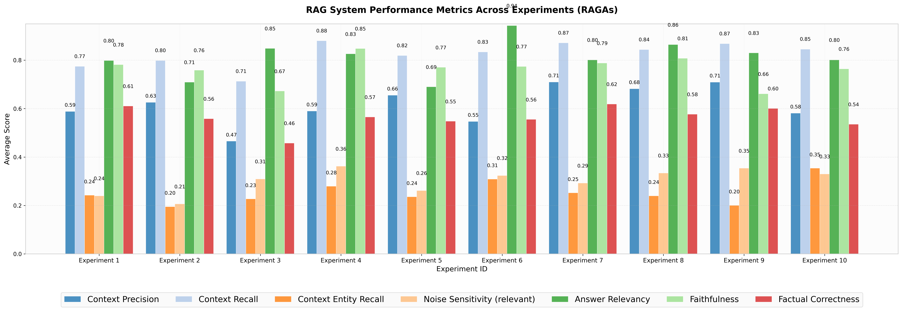
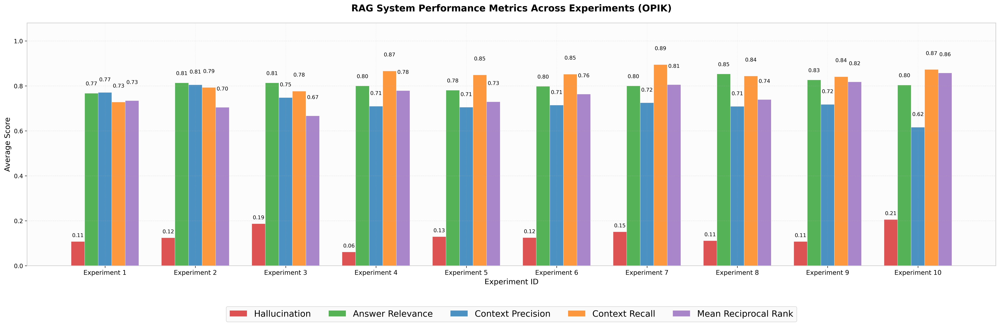

# Evaluation Approaches for Retrieval Augmented Generation (RAG)

## Table of Contents

- [About The Project](#about-the-project)
- [Built With](#built-with)
- [Prerequisites](#prerequisites)
- [Running inside a VM](#running-inside-a-vm-optional)
- [Docker services](#docker-services)
- [Project structure](#project-structure)
- [Usage](#usage)
- [Data generation](#data-generation)
- [Evaluation](#evaluation)
- [Results](#evaluation-results)
- [Contact](#contact)

---

### About The Project

This is my bachelor’s thesis project at the University of Vienna, where I explore different **frameworks for evaluating a Retrieval-Augmented Generation (RAG) system**. The project leverages **Ollama** for running large language models locally, **R2R** for building a basic RAG pipeline, and **Streamlit** for an interactive UI. Additionally, **3 different frameworks for evaluation** are used.

The primary goal is to assess different evaluation frameworks, including **RAGAs**, to analyze how efficient a RAG application is. A variety of **evaluation metrics** are to be used to achieve that.

The application is a **vanilla RAG** - no Knowledge Graphs, no hybrid search, no AI-agents or tools, just submitting a query, retrieving context, augmenting a prompt and submitting it to get the response from the LLM. A re-ranker model is used, however fully optional. During context retrieval **cosine distance** is used as measure.

#### Code Snippet

Located under `project/backend/chat.py`.

```python
def submit_query() -> str:
    query: str = st.session_state['messages'][-1]['content']

    # 1. Request and retrieve the context
    response: requests.Response = requests.post(
        url="http://r2r:7272/v3/retrieval/search",
        headers={
            "Content-Type": "application/json",
            "Authorization": f"Bearer {st.session_state['bearer_token']}"
        },
        json={
            "query": query,
            "search_settings": SEARCH_SETTINGS,
            "search_mode": "custom"
        },
        timeout=60
    )

    if response.status_code != 200:
        st.error(f"Failed to retrieve context: {response.status_code} - {response.text}")
        return None

    # Extract the relevant context (if any)
    # Currently this is very naive - no context filtering and no notion of - is the source relevant
    # One could use a LLM call to classify them
    retrieved_chunks = []
    for chunk in response.json()['results']['chunk_search_results']:
        if chunk['text']:
            retrieved_chunks.append(chunk['text'])

    # 2. Augment the user query with the context
    user_msg: str = st.session_state['prompt_template'].format(
        context="\n".join(retrieved_chunks),
        query=query
    )

    messages: List[Dict] = st.session_state['messages'][:-1] # Exclude the query
    messages.append({'role': 'user', 'content': user_msg})   # This will be the augmented prompt (query + context)

    # 3. Send a RAG request
    response: requests.Response = requests.post(
        url="http://r2r:7272/v3/retrieval/completion",
        headers={
            "Content-Type": "application/json",
            "Authorization": f"Bearer {st.session_state['bearer_token']}"
        },
        json={
            "messages": messages,
            "generation_config": RAG_GENERATION_CONFIG,
            "response_model": "MessageEvent",
        },
        timeout=600 # 10 minutes
    )

    if response.status_code != 200:
        st.error(f"Failed to stream response: {response.status_code} - {response.text}")
        return None

    return response.json()['results']['choices'][0]['message']['content']
```

#### Introduction to Simple RAG

[Paper](https://arxiv.org/abs/2005.11401)
[Examples](https://github.com/FareedKhan-dev/all-rag-techniques/tree/main)

Retrieval-Augmented Generation (RAG) is a hybrid approach that combines information retrieval with generative models. It enhances the performance of language models by incorporating external knowledge, which improves accuracy and factual correctness.

In a Simple RAG setup, we follow these steps:

1. **Data Ingestion**: Load and preprocess data from various source like files, APIs, databases, etc.
2. **Chunking**: Break the data into smaller chunks to improve retrieval performance.
3. **Embedding Creation**: Convert the text chunks into numerical representations using an embedding model.
4. **Semantic Search**: Retrieve relevant chunks based on a user query.
5. **Response Generation**: Use a language model to generate a response based on retrieved text.


*Figure 1: High-level architecture of the RAG application, showing retrieval, reranking, and generation components.*

---

### Built With

#### Languages & Runtimes

[![Python][Python-img]][Python-url] [![Docker][Docker-img]][Docker-url]

#### Local LLM & Serving

[![Ollama][Ollama-img]][Ollama-url]

#### RAG Framework

[![R2R][R2R-img]][R2R-url]

#### UI

[![Streamlit][Streamlit-img]][Streamlit-url]

#### Evaluation Frameworks

[![RAGAs][RAGAs-img]][RAGAs-url] [![DeepEval][DeepEval-img]][DeepEval-url] [![Opik][Opik-img]][Opik-url]

---

### System

This project was developed and tested on the following system:

- **OS**: Pop!_OS 22.04 LTS x86_64
- **CPU**: 11th Gen Intel i7-11370H (8) @ 3.300GHz
- **RAM**: 16GB DDR4
- **GPU**: NVIDIA GeForce RTX 3060 with 8GB VRAM

---

### Prerequisites

- **NOTE**: I expect you to run this project on a **UNIX-based OS**. For Windows you will need to use [WSL](https://learn.microsoft.com/en-us/windows/wsl/install).

- Check if `python` is **installed** on your system. Make sure it is at least `3.12`.

```sh
python3 --version
```

- Check if `pip` is **installed** on your system.

```sh
pip3 --version
# If not run:
sudo apt install python3-pip
```

- Check if `git` is locally available.

```bash
git version
# If not run:
sudo apt install git
```

- `Ollama` also needs to be locally available.

```sh
ollama --version
# If not available
curl -fsSL https://ollama.com/install.sh | sh
```

- Finally, you will need to have `docker`. If not go to [Docker](https://www.docker.com/) and install the version appropriate for your OS.

```bash
docker version

# If not available and assuming you are using Ubuntu 24.04:

# Add Docker's official GPG key:
sudo apt-get update
sudo apt-get install ca-certificates curl
sudo install -m 0755 -d /etc/apt/keyrings
sudo curl -fsSL https://download.docker.com/linux/ubuntu/gpg -o /etc/apt/keyrings/docker.asc
sudo chmod a+r /etc/apt/keyrings/docker.asc

# Add the repository to Apt sources:
echo \
  "deb [arch=$(dpkg --print-architecture) signed-by=/etc/apt/keyrings/docker.asc] https://download.docker.com/linux/ubuntu \
  $(. /etc/os-release && echo "${UBUNTU_CODENAME:-$VERSION_CODENAME}") stable" | \
  sudo tee /etc/apt/sources.list.d/docker.list > /dev/null
sudo apt-get update

sudo apt-get install docker-ce docker-ce-cli containerd.io docker-buildx-plugin docker-compose-plugin

# If you wish to use docker without sudo follow this guide:
# https://docs.docker.com/engine/install/linux-postinstall/
```

---

### Running inside a VM (Optional)

If you want to test in a safe environment you will need a virtualization technology. I recommend VirtualBox, however you are free to pick whichever you like.

- `sudo apt install virtualbox`

The particular [OS](https://ubuntu.com/download/desktop?version=24.04&architecture=amd64&lts=true) (Ubuntu 24.04.2 LTS) I recommend.

After installing VirtualBox and the ISO image create a virtual machine, launch the instance and follow the instructions.

If at any point in time you face problems with running the applicaion run: `docker compose logs -f`. If there's not enough memory to host a model, use a smaller model. By default my project uses `llama3.1:8b`. However, smaller models like [llama3.2](https://ollama.com/library/llama3.2) are available. Be sure to modify the `CHAT_MODEL` environment variable under `env/rag.env`.

---

### Docker services

**NOTE**:

- The `reranker` service is **optional**. A **RAG** application can function without it, however the results might not always be optimal. The model is used in the **late phase of retrieval**, to **re-order the context based on relevance** relative to the **user query**.

- The `frontend` service is also **optional**, one could run: `streamlit run st_app.py` on `localhost`.

1. [pgvector](https://github.com/pgvector/pgvector) - an extension for [postgresql](https://www.postgresql.org/docs/) enabling the storage of vector embeddings and performing **semantic similarity search**

2. [reranker](https://github.com/huggingface/text-embeddings-inference) - a **re-ranking model** used after context retrieval for additional re-ordering of documents based on **relevance**

3. [unstructured](https://github.com/Unstructured-IO/unstructured) - a service used for enhanced **data ingestion**. It supports various file types like `pdf`, `md` and more advanced partitioning strategies.

4. [r2r](https://github.com/SciPhi-AI/R2R) - the **RAG** frameworks server. It provides a `python` SDK and a `RESTful API`. It supports file ingestion, index creation, using more advanced versions of RAG like **HyDE** or **RAG-fusion** and so on.

5. `frontend` - the UI of the application, which provides a GUI in the browser at `localhost:8501`, where a user can interact with the chatbot and ingest data.

---

### Project structure

```bash
├── docker-compose.yaml   
├── env                   
├── evaluation            
│   ├── deepeval_eval     
│   ├── opik_eval
│   ├── ragas_eval
├── experiments.csv       
├── img                   
├── project               
├── Readme.md   # <- You are here!
└── run.sh                
```

---

### Usage

0. Make sure that `ufw - uncomplicated firewall` is turned off, if available on the system. You can run `sudo systemctl status ufw` to check its status. Otherwise there might be some connectivity issues between the docker containers and `Ollama`.

   ```bash
   sudo ufw disable
   ```

1. Clone the repository

   ```sh
   git clone https://github.com/danielpetrov18/Evaluation-Approaches-for-Retrieval-Augmented-Generation-RAG-
   ```

2. Switch into the root directory

   ```sh
   cd Evaluation-Approaches-for-Retrieval-Augmented-Generation-RAG-
   ```

3. To start the application

   ```sh
   chmod u+x run.sh
   # This will make sure that:
   #  1. All environment variables are exported.
   #  2. Ollama is running and has the proper models installed.
   #  3. Docker is running and start all containers.
   ./run.sh   
   ```

4. To check if all containers are running:

   ```bash
   docker ps
   ```

5. To view the docker logs:

   ```bash
   # Execute in the root of the project
   docker compose logs -f
   ```

6. To perform a health check to see if r2r server is available:

   ```bash
   # Expected output: {"results":{"message":"ok"}}
   curl http://localhost:7272/v3/health
   ```

7. You can then open a browser and enter `http://localhost:8501` in the search bar. That will enable you to interact with the RAG service using a GUI. There's a **python SDK** and a **RESTful API** as well. For that you can use `http://localhost:7272` (base url). For further details refer to [R2R](https://r2r-docs.sciphi.ai/api-and-sdks/introduction).

8. Data Generation and Evaluation:

   ```bash
   cd evaluation
   chmod u+x setup.sh
   ./setup.sh
   
   # It will open a jupyterlab instance in your browser
   # Use the generate notebook inside of ragas_eval to generate datasets
   # The datasets will be saved at evaluation/datasets
   # Do note that there is one cell waiting for input
   # Do also note that the project comes with 10 datasets generated by me 
   # For evaluation each folder has their own evaluate notebook:
   # -> ragas_eval
   # -> deepeval_eval
   # -> opik_eval
   #     -> Opik is hosted locally and available at: `http://localhost:5173`
   ```

9. Clean-up:

   ```bash
   # Stop the application related containers (from the root of the project)
   docker compose down 

   # Stop the Opik related containers
   # docker stop $(docker ps)

   # Kill the ollama process in the background
   ps aux | grep ollama
   kill <ollama_process_id> (the one with this command: ollama serve)

   # Re-enable the firewall (if available on the system)
   sudo ufw enable

   # Remove all images and containers (Optionally)
   docker rmi $(docker images)
   docker volume rm $(docker volume ls) 
   ```

---

### Data Generation

**NOTE:**

For proper dataset generation the environment variables from `env/rag.env` need to match the ones in the corresponding experiment in `experiments.csv`.

```bash
TOP_K
CHUNK_SIZE
CHUNK_OVERLAP
CHAT_MODEL
VANILLA_RAG
```

Before re-running the notebook to generate a new dataset make sure you set the proper values and restart the jupyter kernel so that the changes take place. This ensures that both the context used during knowledge graph creation and query synthesis matches the retrieved contexts size and overlap to get the closest possible values.

   ```bash
   cd evaluation
   
   chmod u+x setup.sh
   
   ./setup.sh
   
   cd ragas_eval

   # Open the `generate` notebook
   # Follow along the instructions, documentation and code
   ```

- Do have in mind that **RAGAs DOESN'T** generate the **full** dataset. It will generate **goldens** - entries consisting of `user_input`, `reference` (expected output) and `reference_contexts`. The rest needs to be filled out by you, either using [R2R](https://r2r-docs.sciphi.ai/introduction) or your own **RAG** pipeline with any framework you like (see step 12 in the `generate` notebook).

- For the generation of goldens for all experiments I've used the same `model` and `temperature` values: **llama3.1:8b-instruct-q4_1** and **0.0** respectively. The reason is to try to create synthetic datasets that are as uniform as possible and try to avoid noise.

- For completing the synthetic dataset, i.e. adding the `response` (LLM response) and `retrieved_contexts` the `model` and `temperature` will depend on the corresponding experiment.

- With all of that in mind, one could generate various of datasets and test various configurations. Each dataset will be saved locally under `evaluation/datasets` by default.

- Each synthetically generated dataset will have the following fields (relevant):

```bash
{
   "user_input": "...",
   "reference": "...",
   "response": "...",
   "reference_contexts": [...],
   "retrieved_contexts": [...]
}
```

- If you already have a dataset of your own, ensure that you properly match fields to the ones expected by **RAGAs** metrics or the other frameworks during evaluation. Check out the evaluation notebooks for further explanation.

---

### Evaluation

A vanilla **RAG** application consists of 2 major components:

- `Retriever` - an abstraction, that fetches **relevant context** out of a **vector store** using an `embedding model`, performing `semantic search` or optionally, one could use `hybrid search` by adding a `knowledge graph`, etc and finally, **re-ranking of the context by relevance** (optional).

- `Generator` - the underlying **LLM** that would accept an **augmented prompt**, containing the user query and retrieved context and generate a response.

One can influence the behaviour of both of the components by tweaking various `hyperparameters`.

For example different values for the `chunk size`, `chunk overlap` and `top-K` could drastically improve or worsen the efficiency of the **retriever**. This of course could either lead to a much better or worse response.

To play around with different values one could modify the environment variables under `env/rag.env`.

Do have in mind that the `chunk size` and `chunk overlap` values are **NOT** in **tokens**, but in **characters**, since [R2R](https://r2r-docs.sciphi.ai/introduction) makes use of `unstructured` and `RecursiveCharacterTextSplitter` (as a fallback) for data ingestion.

The reason why I use 1536 tokens when generating with `deepseek-r1:7b` is because of its `thinking` stage. It generates redundant information so one needs to ensure the model has enough tokens available to generate the full response.

#### Experiments

| Test ID | Top-K | Max Tokens | Chunk Size | Chunk Overlap | Chat Model                 | Temp. | Description                                                    |
| ------- | ----- | ---------- | ---------- | ------------- | -------------------------- | ----- | -------------------------------------------------------------- |
| 1       | 3     | 512        | 512        | 0             | llama3.1:8b                | 0     | Baseline with minimal values                                   |
| 2       | 3     | 512        | 512        | 0             | llama3.1:8b-instruct-q4_1  | 0     | Testing instruction tuning effect on baseline                  |
| 3       | 3     | 1536       | 512        | 0             | deepseek-r1:7b             | 0     | Testing alternative model (reasoning) on baseline              |
| 4       | 5     | 512        | 768        | 64            | llama3.1:8b                | 0   | Mid-range balanced configuration         |
| 5       | 5     | 512        | 768        | 64            | llama3.1:8b-instruct-q4_1  | 0   | Mid-range balanced instruction-tuned approach         |
| 6       | 5     | 512        | 1024       | 128           | llama3.1:8b                | 0     | Upper-end retrieval quality                                      |
| 7       | 5     | 512        | 1024       | 128           | llama3.1:8b                | 0     | Upper-end retrieval quality advanced-RAG (RAG-Fusion)                  |
| 8       | 5     | 512        | 1024       | 128           | llama3.1:8b-instruct-q4_1                | 0     | Alternative model with upper-end retrieval settings   |
| 9       | 5     | 1536        | 1024       | 128           | deepseek-r1:7b | 0     | Reasoning model with upper-end retrieval settings                 |
| 10      | 10     | 512       | 2048       | 256           | llama3.1:8b           | 0     | Maximum  retrieval settings                   |

---

##### Description

**NOTE**: all experiments, with exception of the 7th use a **vanilla RAG approach**. The 7th experiment tests if the usage of a more advanced approach like [RAG-Fusion](https://r2r-docs.sciphi.ai/documentation/advanced-rag#rag-fusion) could yield significantly better results. The idea of `RAG-Fusion` is to generate `N` hypothetical questions based on the original one, as to capture a broader perspective and to fetch more relevant context. It uses `RRF` or Reciprocal Rank Fusion to fuse all the documents for the individual queries.

The experiments employ an increasing size of `chunk size`, `overlap` and `top-k` to find out the sweet spot between just enough context and not a lot of noise. Alternative generative models are also compared.

#### How to

The `evaluation` folder contains 3 sub-directories. Depending on the framework one might want to try out, one could switch into the respective folder and use the `evaluate` notebook. The notebooks contain both code and explanation in markdown to simplify the process as much as possible. In each notebook I have a short description of each metric I've used and the corresponding code required for evaluation.

Do note that for evaluation with different metrics, different parameters might be required. Some metrics rely only on `user_input` and `response`, others might require other ones. So if you are using a custom dataset, some metrics might not work, due to missing parameters or invalid names. Make sure you map out the parameters as needed and extend your dataset accordingly.

Do also note that different frameworks use varying names for describing parameters. For example **RAGAs** uses `response` and **DeepEval** - `actual_output`, however they refer to the same.

For all three frameworks one could overwrite the default `prompts` of metrics that are used during evaluation to try to achieve consistent evaluation and or to customize the evaluation as required relative to a specific domain.

For the evaluation of all experiments across the different frameworks I use the same `model` and `temperature` - `llama3.1:8b-instruct-q4_1` and `0.0` respectively.

For each framework the results will be stored in `res` in the corresponding folder.

---

### Evaluation Results





---

### Contact

Daniel Petrov - <daniel.petrov18@protonmail.com>

<!-- MARKDOWN LINKS & IMAGES -->
<!-- https://www.markdownguide.org/basic-syntax/#reference-style-links -->
[Python-url]: https://www.python.org/
[Python-img]: https://img.shields.io/badge/Python-FFD43B?style=for-the-badge&logo=python&logoColor=black
[Docker-url]: https://www.docker.com/
[Docker-img]: https://img.shields.io/badge/Docker-2CA5E0?style=for-the-badge&logo=docker&logoColor=white
[Ollama-url]: https://ollama.com/
[Ollama-img]: https://img.shields.io/badge/Ollama-ffffff.svg?style=for-the-badge&logo=ollama&logoColor=black&logoSize=auto
[R2R-url]: https://r2r-docs.sciphi.ai
[R2R-img]: https://img.shields.io/badge/R2R-black.svg?style=for-the-badge&logo=data:image/png;base64,iVBORw0KGgoAAAANSUhEUgAAADAAAAAwCAIAAADYYG7QAAAIu0lEQVR4nOxZbUzb1fe/bXmUh5aHUGJ5qKihiGgFE7VFhIhCQUSixoAxRJ58iCIQEqqGoI7HjY3AsvBiyxYYbGRPjJIMskG6shQYGwt040VTRmFAOxhQSunab7+055/s5t/0VwoU5u8XX/h5Beeec+7ne+655557S0X/MPxLaC+4HNjSx8cnOjo6IiIiODiYwWDQaDSCIDQazfz8vEKhkMvlW1tbfyvVHeDh4fHDDz+Mjo6azWbYGTqd7uzZs++///5+/VOcV6XT6SXPwGAwAGBqakoikUxOTj58+HB1dZUgCG9vbyaTyeFw4uLiPvzww6CgIITQ/fv3a2pqLl68aLFY9ktuZ9YUSl5e3pMnTwBAr9c3NDSEhYXtbkKlUlNSUm7cuIEDdvv27TfffPPvYePn59fb2wsABEE0NjYGBATsy/ydd94ZGBjA5hUVFRTKPtbEAUJCQqanpwFgfHw8Ojr6wH6+/vprjUYDAE1NTQdn4+vrK5PJAODkyZPu7u4Hd/QMbDZ7YmICAGpraw9i7+/vPzo6ShBEUVHRLmpMJpPP53/66adZWVmJiYlsNnuXRfHy8rp27RoAHD9+fH9rR6VSh4aGAKC8vNyhQnBwcFVVlVwu377hl5aWTpw4ERUV5dAwKSkJqx06dGgfhIRCIQBIJBIq1UEp//nnn58+fQoAJElKJJKjR4+WlJT8+OOP1dXVIpFoY2MDAMxm8+HDh2k0mp0tnU63WCxYIT4+3ik2YWFhBoNBq9WyWCy7IXd393PnzgGARqP5/fffHe44T0/P/Px8pVIJAENDQ/7+/nYKCwsLOEgPHjxwcXHiqMBT/vLLL9tnGhwcBIDBwcHAwMDdnXh4eGA/MpnMTvnWrVsAgGtBYWHhHmzCw8NJkpybm3Nzc7OVU6nUnp4eAOjv73/hhRf2/qxnJqdPnwaA4eFh200qEokAIDk5mSTJ6enpPYJUV1fnMDylpaUAMDY25unp6dCQw+FkZ2d/9913OTk5XC4XZw+NRuvv77dL4fPnzwNAZGTkhQsXACA9PX1HNi4uLmq1WqvV0ul0W/mrr76q1+sXFhZefPFFOxMmk1lVVYWLpy1WVlaam5uDgoIYDIZCoTCZTLGxsdjk8uXLAPDyyy/z+XwAuHLlyo6EPvjgAwDo7Oy0k3d2dgLAV199ZScXCATr6+sAMDMzIxQKeTweh8Ph8/nFxcVjY2M491NTUzMzMwGgu7sbW0kkEgDw8/NDCCmVSqPRuGPV/e233wAgPz/fVujj42MwGBYXF+0WOzU1lSAIkiSFQqHDPCgoKDCZTARBpKWlKZVKkiQZDAZCaHZ2Vq/XYx2cZFwu1zGhrq4uALA7lj/55BMAaGlpsRWyWCyNRmMymQQCgWNf/x9CkiTX19cvXboEAFlZWd7e3haL5c6dO1jhp59+AoDPP//cavIfdS8iIgIhND09bSuMi4tDCEmlUlthY2Mjg8GorKzs6+vbhVBfX19lZSWdTk9OTkYIcbncmJgYCoVy9+5drDAzM4M/zzGhwMDAzc1NazwxcOuDLTECAgK++OKLR48eOXN0NzY2KpVKvEtCQ0N5PB5CaGBgAI8uLS3hDscxIU9PTzs2CCFcdTY2NqwSPp/v4uLS1tZmMpn2JLS1tdXe3m71n5KSYjQar1+/jiV4OtuaR7Uz3p6eOp0OH/5WCT44BwcH92SDIRaL8R8sFispKamtrQ37RAi5uroihMxms2NCWq2WwWDYHagKhQIh9Prrr1slOP442s7AqhkfHw8ANTU11iEmk4nndUxIpVLRaLTg4GBb4ejoKG4brJLNzU27mO0O6xlMoVCuXr06Pz9vHWKz2QghtVrtmJBcLkcI2bWqIyMjKysrn332mbV8K5VKhNDbb7/tJCG8TxFCANDQ0GA79NZbb1kdOkBubi4A/PHHH3by2tpaAPjrr7/wvy+99BI+Mp0khKs2ADQ3N9sNyWSyra0tb29vx5YsFstisUxNTdmdoIGBgRqNxmAwvPbaa1giFosBICMjY082GRkZmE1fXx9OYSvYbDa+Ie1mjzueiYmJmJgYW3lmZiZJkrOzs5GRkQihN954Q6fTra2t4bqyE3g83traGgB0dHTY9TMIofr6egD4/vvvdyOUlpaGP8hoNJaWltq24gUFBRaLRaPRYBICgYAgCJPJVFFRsX0yhFB+fj5JkgBQX1+/vaUPCAjQ6XSrq6t7dFcUCuXevXvWLkIkEoWGhlpHCwsLzWazXq8vKSlxc3NLTU3Ft625ublff/2Vz+dzOBwej1dcXDw8PIw9VFdXO5zoyJEjAPDnn3/uxsY2SGtra7hP0Ov1ra2t1uxJTExUqVQAoFar6+rqcnJyent7cSS2vzd88803DqeIiooiCGJ5ednHx2dvQgih7u5ufKMrKCjAV3qcWHV1dQKBIDY2trW11WAwWOe2I2SxWEQiEc627XB3dx8fHweA3Nxcp9jgAvr48WOz2ZyYmOjl5fXtt99KpVLb9xej0ajX6+1CYjKZxGJxWVlZeHj4Ls5PnToFAD09Pc6ywUhISCAIYmFhISQkBEuCgoKys7OPHTs2MDAgl8tVKtXi4qJMJuvp6amtrU1PT3cm/kVFRQCgUChws7Y/CAQCnU63uLj40Ucf7dt4G6hUanl5OUEQk5OT2298zuLjjz82GAwWi6Wpqel53htCQ0Nv3rwJACMjIzvWZSfx3nvvzc/PA4BcLk9LS9uvuZubW0lJiVarBQCxWGzbix0cDAajvb0dZ+7IyIhAIHDm7YJOp5eVlc3NzeHaIRQKt1/1nws8Hk8qlWJaSqWypaXlyy+/fOWVV2zLtJeXF5fLzcvL6+jowDWTJMkzZ87svu+eC++++25XVxdBELZVR6PRqNVqnU5nWwVUKlVNTQ3ueJzHAV/8fH19ExISeDxedHR0eHi4v7+/q6ur0WhcXl6emZmRyWRSqXR4ePh/9FT9X8U/7qeFfwnthf8LAAD//4XyL+aquwvhAAAAAElFTkSuQmCC&logoColor=black
[Streamlit-url]: https://streamlit.io/
[Streamlit-img]: https://img.shields.io/badge/Streamlit-black.svg?style=for-the-badge&logo=streamlit&logoSize=auto&logoColor=red
[RAGAs-url]: https://docs.ragas.io/en/stable/
[RAGAs-img]: https://img.shields.io/badge/Ragas-black.svg?style=for-the-badge&logo=data:image/png;base64,iVBORw0KGgoAAAANSUhEUgAAADIAAAAyCAYAAAAeP4ixAAADNElEQVR42u2avW4TQRDHc3EQ6QJEQXQ0vAMtFVJyuyDRUfHV8gRIiDQgKkQRg2h4BSQaoKQAFO8awkeAAl4CUST2eZa59f/sTc54t0jubiOvNJrx+s6Zn/93M7s5z00aRsnEei3m547SMEoksSU8b71OL3L8mZW5Ey0MLqm3RkvDyefWHs13IoIxm2vHOPlvFkSLXQA9iw7GvJcMIhnEqpGx7xsVFwxARK7INpQYkJJEMcJAkREIPOXKUDwwZRA28sFEo0gkMH6QSGD8IJHA+EGigvGDhMOQEklDQfwwpgSTJhGAlGDcpvnUXWhGAeLCwPex0HziwjQGJEoYP4gfhjwwtYFUAFNvH3GXMKQkhcGkSbM6uyrmRQZPbGEwWiSNUYSU2OX4D2KbLMfEMU0pAG0Xph6QclL3TSdd4oS28H4PMLlak2F0GaZOkAwg1+zx3XSZ40+A6E1ThpRE0wQM7pm6QW6Ov9nVJX790SapRY/9EEYDQvv7TOUgNAa5gSSOW9+RJzneyiGIYYbHACawadajCEBIiVZugDnF819G94wWuQ+rZoCpDcQAYuS1XObEv0IRC4ObPximUhDaB+LG1F1bYYBtoxxlUABCm2blN7sLgpLaQjU7zfEPVKmehdfTlaGSMocEQnsVue6CTIRR6RmOf9pztchQ1aiCVXNYQwTIbfyxRU5ugc9ZyL0TL6IYnOXXv1DNBuxDFpob7rb5EEByw9rKNsHVE4GPKy6gUQ6gaghM24U5UBDSgpBQNvTiN9tDUvIu+3Wev2dNCfZsSq6zz997ZZRTiv2bswxf2oZbAA5SEWJfwNjLBNe9Iesdw3xxDM6rbqeJ/8ZPBHHkJygyyLs4+gWbHBvmyc6LzKNIKEy4MrTn+YgESLXm388EwJgPVpHvjiJUKwyUoX0wpEUAjBLv8CEZW9Ug/moW/lRXPi92ge5N3hgYLR5PB9EAUeI8W/FBO2x9qFO39TmnHeR1C5dY6z8wlwqYq6zEX5TORpnb/Tk/C+KDOccqPWL/gu0N2+s6DTm8JCUemE2xgj3QtJsekjV7+CHcH9ewtUz3ctKY5LtXEuqIlu3yszEbsxE8/gFo+tDaHmgtXAAAAABJRU5ErkJggg==&logoSize=auto
[DeepEval-url]: https://docs.confident-ai.com/docs/getting-started
[DeepEval-img]: https://img.shields.io/badge/DeepEval-black.svg?style=for-the-badge&logo=data:image/png;base64,iVBORw0KGgoAAAANSUhEUgAAADAAAAAwCAYAAABXAvmHAAAIQElEQVR4nMyae1RU1xXGf/NgkGcCgiCDKD4Ah1mKrU5MtLpIa9KuVU2iRgxGkohJGl1toyutUesz2iZ1afPStGtpaEk1cS1NrEnaPExITVdQiIoGeRmTAIMoIAjzQGQYus6Fe53R4TWD4PfPzN1nn3O/fe85e++zz9XSDwgjKS6W1NRoTKZwkg3BxI4MJCpChTpItDtx2OzU1Foxl9dztvgieXlmcj6/Qmmlr/dWedsxlNExySzJGMu8tDCSUrwZo4GSglLe3ltEVraVyhpvxuizAeEkx09l4/rRPJiuRqvz5qY3wonj2ncc2nuMDS/UU/R9X/r22gANQ7RT2fz8JFasVaMd4kmnhUYuc5YmfsBODa3YJLkfQQQSxR2MIhwD/tzRlSEtp9ixJZd1Lzq55ug3AyJJSZzFW9kRGE03tjVRznd8gJkc6ikB2nu8ZThJxJLKaH5JKCNv0qjjTN5HpC+q5+y3Phtg5KmFM3l9twa/IFd5NbkUsodqjvWCdNe31zMdI0uJYrJbSyu2xs95+rFS9v6ruxE03TVOZfPK6Wz7qxqNvyyzUsWXrKKA17Bi9pL4dVio4DyHqKOQYaSgI7STmG7IWOYuALW1ii9y+2zAXWxaeRfrt7u+JTFVPmMZjfT4Zr0wpJxzvEcQwwkjQRarYpl5vwqNxUyORyM8GmAgc+EMtv9NJi8myEl2cII/46S138nLEGNXcAQHLQznbuXJ6Zk5y0p1WS0nCm/sc9MaiGBiQhrHT2rwD5LJ57Kebzl4y4h7QhKPYmK1ct1Gq20/ph/XUVDqquf2BtToNA/wnw+D0cfLMvHkS9k7MKxdUMcZ6flGM6WTm0Y3nGmmIt7MaqdN8RpuBtzN1rVjmbdYvhZzXkybwcIl8glhpLImAonSO3E0VfFfZT0oUyiM8aMXcaZIjVbyOBbMvM9cHJ3BaLCgJYg5vEcweum6FXvTP0lOsPDDJVzfQCpvbI/AqDjj/7HqlnibvkIsbBEsRdBDIuznH0Bk8Hne/RBpakmJ2aiYMTy4SO4kglQVRweP9Q0QXC5w3YsmkLZEJJPIBoxnyWLXxExE2NsNhexW/guuBp7IQDZgHA+nyY3idXWkB7cXLnJc4iZjLPMXiF/1nSSMCCdpktwgPI/3uc2tRHsntw4IzmEkjdDGknqvq5rIKnvC8xuX09RoofB0Kfm5p2luvuoVpYCAIZimTcI4IYGQ0CBe3LirW/1KckhhuXItuGujME2RBSKf70iJu8fS5Y8wNCJM+m+3N/P+wU95dVsWRd+U9Yq4wTiO3/w+k9lzf0ZgUIAku1zX0KMBDZTQQhP+nQlfFCaTeijGZFlBbEb6On0CAwNIWzyHo6cOsHXHKvx0fl3q6nR+ks7RgoOkLZ6tkO892iUjZIRjMGhDGBEnCxrp027ODRqNhmUrMqiqrObAvn/zaOZct/bs3Qd47Mn5ko4vaKKCaDr2VYK7NoDISLmxmVqfBhfQ+esYrh/Guq2/dZN//MEX+Pv7voW+Sp3yP5CoSK0arbLTavUybdi67jUqy6uk/6dPFndJ9PDBTzl/rsMVxo3Ss2bzr/t8r1bsyn8V6iC1V4xvgMqL4kx7P3lqbTtOmwp1CJ3VA2/g+iQ3rf4LOZ985VFvzrxZ/G7dM95yleBHoPLficOmtVFdE4xeMiCQYT4NLmCz2qkyX2TNipfc5Bcv1GC1+J7ZBqAsWexcqtFaMVcEox+DlNTFez1wW1sbL7+0hz273sHpdPLGy9k36by+/R+E3hnKs6syJa/lDUJQnCaCu7qe4mJZMBRDn4t1dlsz+986zIyUeWxZ+4pEviuINqEzY9J8qY8Ign2DijASlavLnC3SXiIvz8Djy4TAnzsII4kGirsdZvfOfTResVJ4ppSvvUglRMT+VcZqVjy9CdO0FIwTEgkJDe6xXzhJShRG2rHl5atEQrSY4gpZWMBOztB9SB8sTGCZWy6UTWKcuoGSynpKTsnCjp2P10XrWwiVsisTEJyvUFYpxYEy3tknN4QykhimDRLJrhHDdLc6ahlvS5wlA4rJynbiuCY3Glk6OCy7gSsnJ46WIrIkNycZYKGi5jyHlLcQzRT0zBgcph4guES7FH/L2P+mfCCiTPZwkuPTKSiSa/9WqjjMQ7dFWWU27xJCrHTdUVYZn2Chwr2s0kztFT9CVDFMk3ZoOkKlQmsFRwaPPXAPW9yefj5b1nzPYYWUWzi8wJdfjeaBnwcSJVWRwkiQCq21nBpY1p2YyHLGo1R7pIOPT8h4qh2nkgq6ZaNtXHV8TPoiB/ZGWfYjVkqF1oGGkSeZyDLluhVb40ekpztpbXPVuykhaaam3oK5ZAwPLZAzZT0/kZbLJfIHhLx48pO4nuG2g/MISx4x89lNZwQeM6o6Tpeo0Fj1zLxflgnPFMJIqUJ2q84IxIIVc9512gjksfm507z6d099ukwJO05E1JZYZt4neyuxJuL5hbQvtbgUmfoDwlX+lF1uZ2XiyefzwnPH2bCjq3495gwGMhemsnO3fOAho5pjUrnP10M+EfVFkJLPAWS0Ym/M4ZnHS8g+1P0IvUAEExPvIzs7ggkDdMxamCecyWW+8f2YVYYaP81kVj87mVXrtQSGetK5RpNkhIVKmqlTgqCY22InFUqclM/rCPF4Dwf2phNs2/w1f3qljZb+O+h2RQhxUffwxw3jSMvsx08NWs6xPyuXP2xs6jy46C18+NgjPsbAExnjeNinjz3K2C997GGhfGA+9vCEO0kcEUvqvdGYTEMxSp/bBBAZIdec2nHa7FystWAub6BI/twmp4GSCl/v/f8AAAD//6MkxmUVnxs+AAAAAElFTkSuQmCC&logoSize=auto
[Opik-url]: https://www.comet.com/docs/opik/
[Opik-img]: https://img.shields.io/badge/Opik-black.svg?style=for-the-badge&logo=data:image/png;base64,iVBORw0KGgoAAAANSUhEUgAAADAAAAAwCAYAAABXAvmHAAAIfElEQVR4nNRaC1BU1/n/zrl3Hyws8hAWUVkjGvwbA8QoaqLJX8P4SDok1LEaTWt9pulEk3GiRk1jddSJM820oWOtj7HmoU0aNL6I0THSqCEyKoPis9EVZRFYWFn2fV/ndO7FXZbKLlfdJZPfzJl7Ht+95/f7znce9+6ylFL4OYONeQ8SwcLN+oHEajMTW2sG9XEGQABIr/NiU0oD099Uy5r71AKDycM8PiYCJLsjhdtfPoM/+sPL4rkrY5CfN4a1pQAOxLq5kXn/Tps58eOM4uf2PogYFM0QEi5ff8L3t90rhaMVU0Eiuoi2hEKTj4DdT4FIAJQgoASgV8HQivx/rSnWmVJsPSZAuHbj//ybP1vFHz01HVEacVQDxO+GEAcSENAuwpj/+JmC8o/GMXot113f+FHJe7Z+ssQ5fWG1UP7dLKSRWNASCJecIMJ1nwCtIgHAFBADgOQrDlzb867q/4y8VVL6tpr+H3oEiNer96zesE0oP/WaGnslXHwUaCBcpHZvt+cDI9FRp8/KuDHuyq5B3T33oSax1NiQ6X5n+VfEUluAtJFtZfc0eAi0CbJ3URgrpFjSezkZ/tuN2Vzj3XRdRuS58MACiLMt0bV0SRm1WvOhW/IUGt0EXBIAYuS1M4RiaD5IPfQKILo8idEVIAise827n9Om292Sl3HXQ8CtkA/UIIBgyP5P/h75wDggBgv6vmnW7vp4IAHuv64vIdeqp3QXNjI8HAWHHDay50O82jnfFdrbUwtHHGYMen93/agWwFUce0k8dfh1NZ4nFMDupIAZZV52QTxyOCGW5bLfX7BSDS91AoiEuS83rwcNVbXsujxUIS57HwNVBHUpIkw4PbZy3oqEJ7IvRU2A/9vS2bTlVp6a0JEIgIsPXXHuiZBzGHOMMamFSoCEVmcq4akuNJziBg24kLVo9tr0Vwr3qOGlTgDPabmyLWuUzUgF3C4AihAglgKIAEijcadMLtqWPPHFTw1DhtRgrVaU7QjPazwXr+b7bt4eApgRDTnZFxKGPq7K66HodiPjKg9N9e98r1TtAxsbEAh8+0aVMPzZvX3feneRNiPzzoMSU4tuR0CoLF2IVHpfEORjDQOYoSR12pzVpjlvruuYnLFBRAHE09pLqqsaj7TqjhsCJ6/fFJIKizeZ5ixaFy2SkRBRgFR3oQBpJI3ah0mAQZuRedW0YPnSqLBTgcgjYLuSrzZ8ZMiTN+3Xby/DOn23x+BoIbIAd70Z9JhjMvO/R3FJdqmxpoC6bOZw9kxSUr2xoPBQTJiGQUQBKD6xxTB/Tx7lagdT0Z2o673yLeHC/ln893/Z2NW7hD7nyUrAuEe/EkQUwOaMPu6vmFFOeXsfpQJrfNonlq5kh07eRZ3WbKRLdEh3KsdTSYiTm7V9+93oId4dHCM1cudXlwTJyyBCHF+z4c/6sZ+Poz6rmTiv5jI5haX8ifd3yM2MAUk9wLkTwp5tiL8lhbp+zOuqTbKffo47987Hwo/blwH2xMu7NM7MO8n0HlwTU7ZdIKwAjLUCABa6akP6NBvbv/gTnJx7GsX3q9UOX7xCO+L3GyRPdUFM2XbFM2yLNtHF9Jlw8L56Js7JZk46oB9VMtfwQtkYYj/zrDZ/yQfE39SHOC7mx5jvfYh4PNY9tf5NnDTsdKCMdL3r9WO2FeM4U/trnuA2IF2Kw1+1ogTHmy2GCfv/vwc4d4KqrxLEdWMQFX0GJsFskTx1ZsY48DoAJt7yopPEcWlUwE43atNUTf+ivbEmHQpVLyjYmH2dSciyeI5NPus7Numi9/jLJ8WW08+Ekpch3t43M2ZMw3GL1ChYy4rcXw12chf/9J7YcnY09dzOketJ2+WRxFN3/47MxnlB4rQg8arPT4+KiAKI43I+SH6jZD/7DO415BJoEltAWYVMt7T9i/aw5mlbg8aaRDuT/FSF+0CuzX0w1ybZq0b0AH/5VZSGT6JPJ1gP/0Ly25PlsuRtShPqyookny0tYCO2nHtatqFcay/ucsky15f9qJy4a1sWR3x2lFLkOcDoObbv5ENYl9IKvNMoWg/+initZoQYMWiSOvwc8TebCNeaymYV78ZJwypxcu4PbL+XSqF+6+/g7Ohq4G29YzUAKj+rEOQ9MeMIcdSMkUtC7Rdz4wu/GQlYIwKRsHhz1wKkMbZpsl4pNRQeHh287a6gASAYqBSzH1JULqOWx7xHnreE1sVNODicads3FSSvAbI3LAXESmA/Mgkady6EtGm7If2XHV8WJGci2D5cAsmvfQb6wdejqkBVrPHOeNeebHcgvl2lA3xSQ+lU+p2RKsn+7QuKXcXgOqV8ItlPhTZj8H7H11NoFUNp/Yr1nZ7rqhgd2zkQgMbo0Y34cDYyDqpBCQMv657eOB+njj8OxoKTkJB3BhKePK/YadOblCub2gxIy4P75FiwFO8DwdoXBh54EdKXbYSWHXPg1sItih1jdPXMCKhNXHMqbfpiOuUa05XytfHHFc+fz2jsGI3Dk2jDB8uj1WeUiMuERazkJZ+OWpdtpI6vJ1Pb5tdplY6ntXO3U9FhpE0fLaZCc0rwPskTRyWvPli2bXqD+q4+3rMCrH9/Q4n7qsITStlZ/rziddn7io3AKFf7rleV+uYdc4L31s7bRm/+9h/BctvRQso3mHpWgGXtHxUBp4da2uskRFt2/oZ6LwxTys1b59P6Vesob+tNXSfGUsKz1FE2hXqqc5XREO4mtZP/ZiIVWnv1fAiJHj1t/OdM6qs139cW8LqcLK/uDtbXDLhJLbM+7WR7Z+0q6rcMeND+H32DYQx+MM3Y3WWb1JbUkXd05HMqCwAbvJ1s+/xh/cN0H9u/GqTO2w78rSzg67Igc92qYL0mvTlaXUT1l/qfAo/8Q/dPjZ+9gP8GAAD//3np7RgjW4OcAAAAAElFTkSuQmCC&logoSize=auto
